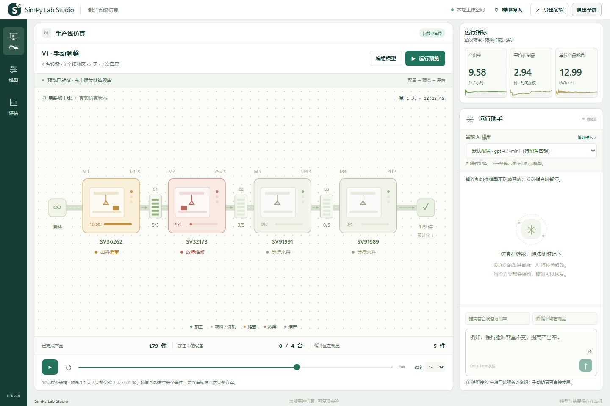
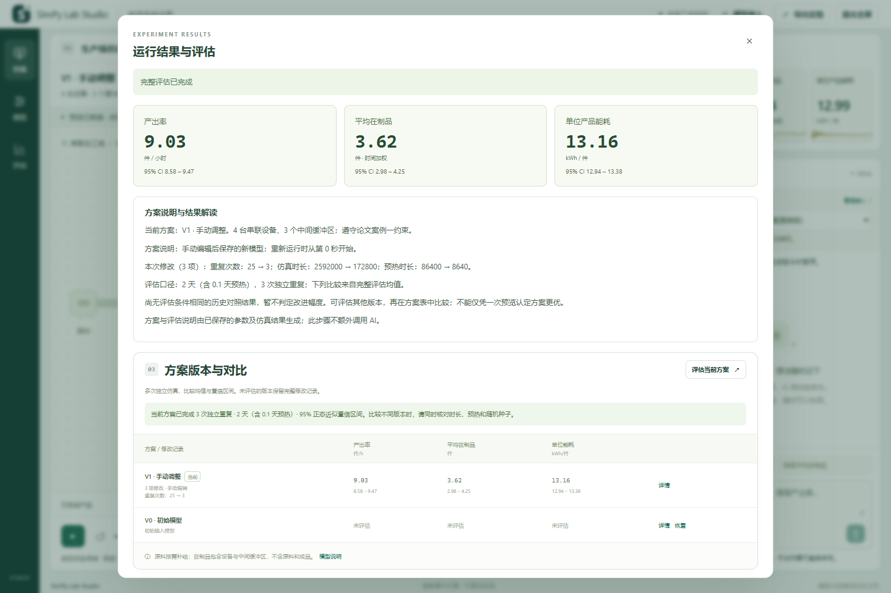

# SimPy Lab Studio

当前交付仓库为 [Sylphiette666/SimPy-Lab-Studio](https://github.com/Sylphiette666/SimPy-Lab-Studio)，本测试版使用 `roxy_beta` 分支及[同名预发布 Release](https://github.com/Sylphiette666/SimPy-Lab-Studio/releases/tag/roxy_beta)。当前代码包含[可靠性更新](docs/reliability-update.md)、[密钥回填与 DeepSeek 配置](docs/model-settings-update.md)，以及[九项高优先级更新](docs/productivity-update.md)：持久草稿、表格导入、参数提示、瓶颈与统计诊断、批量实验、连接测试、实验管理和备份恢复。

**[查看 roxy_beta 完整改动汇总（相对 v1.2.0）](docs/roxy-beta-changes.md)**：包含功能对比、操作入口、使用边界、主要代码位置及验证结果。

[下载当前源码 ZIP](source-packages/SimPy-Lab-Studio-test-source.zip?raw=true) · [源码包说明与校验](source-packages/README.md) · [历史 v1.2.0 发布说明](docs/releases/v1.2.0.md)

> 版本基线仍为 **v1.2.0**，界面标识为“开发更新”。当前功能尚未发布新的正式安装包，历史正式包不包含后续更新。本机测试 EXE 位于 `F:\Simpy\SimPy Lab Studio 测试版\SimPy Lab Studio.exe`。

本版新增 **图形建模**（拖放设备与容器、端口连线、参数编辑、撤销/重做）、**运行助手对话工具**（搜索、复制、导出及表格/代码/公式离线显示）、**可选的本机密钥加密保存**，以及**历史方案完整评估详情**。对应改进名单第 1、4、6 项，保留原有仿真、AI 调整和评估功能。见 [v1.2.0 发布说明](docs/releases/v1.2.0.md)、[图形建模说明](docs/visual-model-editor.md)、[对话工具](docs/conversation-tools.md) 与 [密钥保存](docs/credential-storage.md)。

带独立窗口的 Windows 制造仿真软件：编辑生产线模型，观看 SimPy 状态回放，随时切换 AI 模型，用自然语言生成新方案，并通过重复实验比较结果。

在“编辑模型 → 加工设备”中点击 **“添加设备与容器”**，可选择插入位置、填写设备参数和配套容器的容量/转运时间。添加后进入自定义实验，最多支持 12 台串联设备；原论文方案保留。编辑名称或移除工位后，点击“应用修改并预览”保存并运行。



## 下载与启动

当前开发更新可使用本机测试 EXE，或按下方步骤从当前源码运行和构建。[原仓库的 v1.2.0 Release](https://github.com/Sylphiette666/SimPy-Lab-Studio/releases/tag/v1.2.0) 是历史安装包入口，保留用于回溯旧版本。历史安装程序会检测 WebView2，缺失时使用微软官方程序联网安装；电脑已有 WebView2 时可以离线安装。

已安装旧版的用户，先退出软件再运行新版安装程序，可覆盖更新并保留实验数据。第一版安装程序和便携包仍可从 v1.0.0 发布记录下载。版本变化见 [v1.2.0 发布说明](docs/releases/v1.2.0.md)。

安装完成后可从桌面或开始菜单启动，在 Windows“已安装的应用”中卸载。卸载保留实验数据。详见 [安装和分享说明](docs/installer.md)。

也可以选择便携版 ZIP，解压后双击：

```text
SimPy Lab Studio/
└── SimPy Lab Studio.exe
```

便携版文件夹中只有一个 EXE，图标和界面资源均已内置。安装版还会添加卸载程序和使用说明。两种版本均无需安装 Python、运行 CMD 或先启动服务器；后台服务随软件自动启动，主界面显示在独立桌面窗口中。退出软件会停止它启动的服务。

支持 Windows 10/11 x64，需要系统的 Microsoft Edge WebView2 Runtime；不要求打开 Edge 浏览器。缺失时从 [Microsoft 官方页面安装](https://developer.microsoft.com/microsoft-edge/webview2/)。首次打开单文件 EXE 需要解压内置运行库，请稍候。本开源发行版尚未进行商业代码签名。

## 可以做什么

- 从论文案例一的四台串联设备开始，修改加工时间、可用率、维修时间、功率、缓冲区和班次；支持 JSON 导入导出。
- 在占据主要区域的画布中观看真实 SimPy 状态的二维回放：设备加工、堵塞、缺料、故障、缓冲占用、产出和指标曲线；运行预览进入全屏工作区，可暂停、变速和拖动时间轴。
- 在“模型接入”中保存多套 API 地址、模型名称和接口格式，例如 OpenAI GPT、DeepSeek 或兼容服务；在助手面板中随时切换。
- 点击运行助手右上角“放大”，在大窗口中阅读完整对话和继续输入；放大后正文字号增大，可通过“收起”、外侧点击或 Esc 返回侧栏。切换视图不暂停回放，也不清空消息或未发送的输入。
- 输入调整目标时保持播放；发送有效指令后暂停回放，由所选模型提出结构化修改，通过参数和案例约束校验后创建新版本并从初始状态重新仿真。每次回复与版本记录实际使用的 AI 模型。
- 回放自然结束后，自动为当前版本请求完整重复实验；也可手动评估。比较产出率、平均在制品与单位能耗的均值和置信区间，查看方案说明、恢复历史方案，导出实验 ZIP 与独立 HTML 报告。

API 密钥默认仅本次运行使用。v1.2.0 起在“模型接入”提供可选的**在本机加密保存密钥**：勾选并保存后，重启软件自动恢复；取消勾选并保存会移除磁盘副本，“移除此配置密钥”同时清除本次使用和已保存的密钥。使用 Windows 当前用户 DPAPI 保护，磁盘只写密文。当前滚动测试版打开设置时自动回填密钥，默认遮挡，可点击“显示”查看；普通配置列表和实验导出不含密钥或密文。没有 API 密钥也可以使用编辑、回放、评估和导出。详见 [密钥保存说明](docs/credential-storage.md) 与 [DeepSeek 配置更新](docs/model-settings-update.md)。

## 使用顺序

1. 打开应用，可点击“图形建模”拖放设备与容器并建立串联连接，也可点击“编辑模型”或左侧“模型”修改初始输入；所有机器、缓冲区、班次和实验设置都在输入模型窗口中。点击窗口外的遮罩即可返回主界面，再次打开时保留当前草稿；仍需点击“应用修改并预览”才会保存并运行。
2. 点击“应用修改并预览”，或关闭编辑窗口后点击“运行预览”，进入全屏工作区。中央观察生产线，右侧查看动态指标，底部可暂停、重播、拖动进度和变速。
3. 需要 AI 调整时，在“模型接入”填写服务提供商的 API Base URL、模型和密钥并启用；右侧可随时切换配置。
4. 在运行助手输入目标，例如“保持缓冲容量不变，将第一台设备的可用率提高至 90%”。打字和切换模型不会暂停；发送后暂停回放，检查修改预览并点击“确认应用并预览”后才创建版本。请求失败时，原回放仍可手动继续。
5. 回放自然结束后自动计算完整评估，完成后点击“查看最终结果”；也可随时通过“评估”入口手动评估当前方案。查看最终指标、修改记录与条件一致的历史对照，导出结果报告或完整实验。



完整评估就绪时显示提示，不会自动弹窗抢走焦点。全屏模式保留助手、指标和控制按钮；不支持浏览器 Fullscreen API 的桌面宿主使用占满应用视口的沉浸布局。

模型和评估窗口均支持点击窗口外关闭，也保留关闭按钮和 Esc。窗口内点击、滚动及从内部拖动到外部不会触发关闭；关闭评估窗口不影响正在计算的任务。

本机保留第一版及一个持续覆盖更新的工作版本，不按功能另建目录或分支；后续迭代直接更新本仓库 `main`。只有另行发布带版本号的 Release 才代表新的正式发行。用户实验及模型连接列表会保留，Git 历史可追溯各次修改。

软件“帮助”菜单内也有使用说明、软件信息和组件许可。完整说明见 [桌面版使用说明](docs/desktop.md) 与 [模型和仿真说明](docs/studio.md)。

## 数据与边界

数据保存在 `%LOCALAPPDATA%\SimPy Lab Studio`；可从“文件 → 打开实验数据目录”进入。软件旁不产生数据文件。替换 EXE 不会删除实验记录；关闭窗口后未完成的任务下次需要重新运行。

暂停控制的是已计算采样帧的回放，不会冻结后台正在计算的 SimPy 进程。每次 AI 调整会从初始状态运行新模型，不会把加工到一半的工件直接转移到新模型。预览可能只覆盖完整实验的一段时间；正式评估按所设完整时长与重复次数计算，结果单独显示。当前是串联制造线的二维离散事件仿真，图形编辑仅支持串联路线，不包含并行分支、返工或写实三维工厂。工程应用需结合实际生产数据校准；详见 [案例一参数与假设](docs/paper_case_a.md)。

## 从源码运行与构建

需要 Windows、Python 3.11+（发行版使用 Python 3.13 x64）。

```powershell
git switch main
python -m venv .venv
.venv\Scripts\python.exe -m pip install -e ".[desktop,desktop-build,dev]"
.venv\Scripts\python.exe desktop_entry.py --data-dir outputs/workspace-desktop

# 可选：本地构建此分支；产物位于 dist/，请勿覆盖保存的第一版发行文件
.venv\Scripts\python.exe tools/build_desktop.py

# 在装有 Inno Setup 6.7+ 的 Windows 上构建安装程序
.\tools\build_installer.ps1 -Python .venv\Scripts\python.exe

# 单元与集成测试
.venv\Scripts\python.exe -m pytest
```

浏览器开发模式仍可使用 `python -m simlab.cli studio --open-browser`。桌面壳使用 [pywebview](https://pywebview.flowrl.com/guide/freezing)，单文件构建使用 [PyInstaller](https://pyinstaller.org/en/stable/usage.html)。构建会收集组件许可并嵌入软件，产物不包含用户实验或真实 API 密钥。

改版的浏览器交互验证使用 `tools/check_workspace_browser.cjs`，覆盖布局、播放与暂停、发送时调整、完整评估、导出及原功能入口；测试服务注入固定 AI 响应，不调用付费 API。启动方法见 [改版验证说明](docs/workspace-redesign.md#开发运行与验证)。

本仓库整合原 SimPy KPI Lab 与 SimPy Lab Studio 的历史，保留底层仿真、测试代码与原有许可，按 MIT 许可发布。
