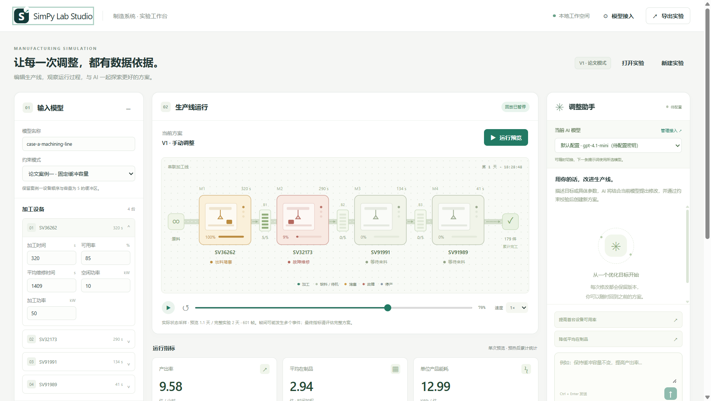

# SimPy Lab Studio

[下载本分支整理好的源码 ZIP](source-packages/SimPy-Lab-Studio-v1.0.0-source.zip?raw=true) · [源码包说明与校验](source-packages/README.md)

带独立窗口的 Windows 制造仿真软件：编辑生产线模型，观看 SimPy 状态回放，随时切换 AI 模型，用自然语言生成新方案，并通过重复实验比较结果。


## 下载与启动

分享给其他人时，推荐从 [Releases 下载安装程序](https://github.com/Sylphiette666/SimPy-Lab-Studio/releases/latest)中的 **`SimPy-Lab-Studio-Setup-1.0.0.exe`**。双击进入中文安装向导，选择位置和快捷方式即可完成安装。安装程序会检测 WebView2，缺失时使用微软官方程序联网安装；电脑已有 WebView2 时可以离线安装。

安装完成后可从桌面或开始菜单启动，在 Windows“已安装的应用”中卸载。卸载保留实验数据。详见 [安装和分享说明](docs/installer.md)。

也可以选择便携版 ZIP，解压后双击：

```text
SimPy Lab Studio/
└── SimPy Lab Studio.exe
```

便携版文件夹中只有一个 EXE，图标和界面资源均已内置。安装版还会添加卸载程序和使用说明。两种版本均无需安装 Python、运行 CMD 或先启动服务器；后台服务随软件自动启动，主界面显示在独立桌面窗口中。退出软件会停止它启动的服务。

支持 Windows 10/11 x64，需要系统的 Microsoft Edge WebView2 Runtime；不要求打开 Edge 浏览器。缺失时从 [Microsoft 官方页面安装](https://developer.microsoft.com/microsoft-edge/webview2/)。首次打开单文件 EXE 需要解压内置运行库，请稍候。本开源发行版尚未进行商业代码签名。

## 可以做什么

- 从论文案例一的四台串联设备开始，修改加工时间、可用率、维修时间、功率、缓冲区和班次；支持 JSON 导入导出。
- 观看真实 SimPy 状态的二维回放：设备加工、堵塞、缺料、故障、缓冲占用、产出和指标曲线；可暂停、变速和拖动时间轴。
- 在“模型接入”中保存多套 API 地址、模型名称和接口格式，例如 OpenAI GPT、DeepSeek 或兼容服务；在助手面板中随时切换。
- 输入调整目标，由所选模型提出结构化修改；通过参数和案例约束校验后创建新版本并重新仿真。每次回复与版本记录实际使用的 AI 模型。
- 执行多次重复实验，比较产出率、平均在制品与单位能耗的均值和置信区间；恢复历史方案，导出实验 ZIP 与 HTML 报告。

API 密钥按配置分别保留在进程内存中，退出后需要重新填写；地址、模型与配置列表会保留。密钥不会写入配置文件或实验导出包。没有 API 密钥也可以使用编辑、回放、评估和导出。



## 使用顺序

1. 打开 EXE，在左侧编辑初始模型并应用修改。
2. 运行预览，观察生产线状态；预览不是完整统计评估。
3. 在顶部“模型接入”填写服务提供商的 API Base URL、模型和密钥，保存并启用。
4. 在右侧输入目标，例如“保持缓冲容量不变，将第一台设备的可用率提高至 90%”。
5. 对新版本运行统计评估，比较效果后导出实验。

软件“帮助”菜单内也有使用说明、软件信息和组件许可。完整说明见 [桌面版使用说明](docs/desktop.md) 与 [模型和仿真说明](docs/studio.md)。

## 数据与边界

数据保存在 `%LOCALAPPDATA%\SimPy Lab Studio`；可从“文件 → 打开实验数据目录”进入。软件旁不产生数据文件。替换 EXE 不会删除实验记录；关闭窗口后未完成的任务下次需要重新运行。

每次 AI 调整会从初始状态运行新模型，不会把加工到一半的工件直接转移到新模型。当前是串联制造线的二维离散事件仿真，不包含任意流程拖拽建模或写实三维工厂。工程应用需结合实际生产数据校准；详见 [案例一参数与假设](docs/paper_case_a.md)。

## 从源码运行与构建

需要 Windows、Python 3.11+（发行版使用 Python 3.13 x64）。

```powershell
python -m venv .venv
.venv\Scripts\python.exe -m pip install -e ".[desktop,desktop-build,dev]"
.venv\Scripts\python.exe tools/make_desktop_icon.py
.venv\Scripts\python.exe desktop_entry.py

# 构建单文件 EXE，产物位于 dist/SimPy Lab Studio.exe
.venv\Scripts\python.exe tools/build_desktop.py

# 在装有 Inno Setup 6.7+ 的 Windows 上构建安装程序
.\tools\build_installer.ps1 -Python .venv\Scripts\python.exe

# 单元与集成测试
.venv\Scripts\python.exe -m pytest
```

浏览器开发模式仍可使用 `python -m simlab.cli studio --open-browser`。桌面壳使用 [pywebview](https://pywebview.flowrl.com/guide/freezing)，单文件构建使用 [PyInstaller](https://pyinstaller.org/en/stable/usage.html)。构建会收集组件许可并嵌入软件，产物不包含用户实验或真实 API 密钥。

本仓库是 [SimPy KPI Lab](https://github.com/Sylphiette666/SimPy-Kpi-Lab) 的独立桌面发行项目，保留底层仿真与测试代码，按 MIT 许可发布。
