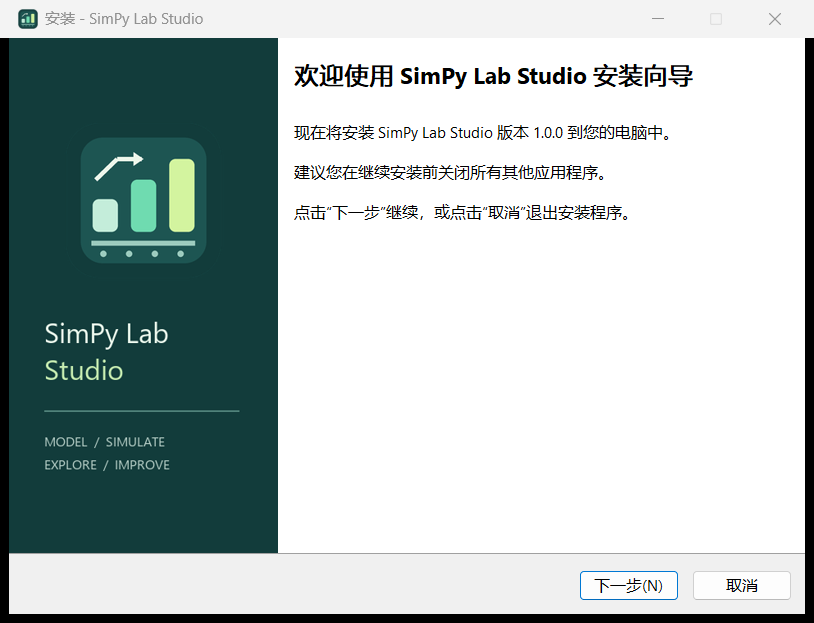

# 安装与分享说明

把 **`SimPy-Lab-Studio-Setup-1.1.0.exe`** 发给对方即可，也可以分享 [GitHub 下载页](https://github.com/Sylphiette666/SimPy-Lab-Studio/releases/latest)。无需发送源代码、Python 环境、CMD 文件或自己的实验目录。



## 对方如何安装

1. 使用 Windows 10/11 x64 的 Intel 或 AMD 电脑，双击安装程序。
2. 按中文向导选择安装位置，决定是否创建桌面快捷方式。
3. 点击安装。若缺少 WebView2 Runtime，安装程序会使用内置的微软官方引导程序联网安装；已有该组件时跳过此步骤，可离线安装。
4. 安装完成后，从桌面或开始菜单打开 SimPy Lab Studio。
5. 需要 AI 功能时，在“模型接入”中填写自己的 API 地址、模型名称和 API Key。不使用 AI 时，模型编辑、回放、统计评估和导出仍可使用。

默认安装到 `%LOCALAPPDATA%\Programs\SimPy Lab Studio`，仅为当前 Windows 用户安装，通常无需管理员权限。安装程序会创建卸载入口、软件快捷方式和本地使用说明。运行时自动启动自己的后台服务，退出时停止，无需先打开浏览器或启动本地服务器。

如果 WebView2 安装失败，向导会提示重试；请检查网络或组织策略，也可以先从 [Microsoft 官方页面](https://developer.microsoft.com/microsoft-edge/webview2/)安装 Runtime，再运行本安装程序。检测和安装方式遵循 [Microsoft WebView2 分发文档](https://learn.microsoft.com/en-us/microsoft-edge/webview2/concepts/distribution)。

## 更新与卸载

更新前先关闭 SimPy Lab Studio，再运行新版安装程序。安装向导会复用之前的安装位置。运行中的软件会阻止安装或卸载，避免替换正在使用的程序文件。

在 Windows 设置的“应用 → 已安装的应用”中搜索 SimPy Lab Studio，选择卸载。卸载程序会移除软件文件和创建的快捷方式，保留 `%LOCALAPPDATA%\SimPy Lab Studio` 中的实验数据，不卸载其他软件也可能使用的共享 WebView2 Runtime。

安装版和便携版使用同一 Windows 用户的数据目录。切换启动方式不会复制、重置实验或模型连接列表。API Key 仅在内存中保存，退出后需重新填写。

## 分享注意事项

安装包不包含你的 API Key、账户信息或实验数据。对方首次启动使用默认案例一模型。软件和安装程序尚未进行商业代码签名，Windows 可能显示未知发布者提示；请从本仓库发布页获取文件，并核对同页的 SHA-256 校验文件。不要关闭系统安全防护。

安装程序只支持 Windows x64，本次在 Windows 11 中文版实测；未在 Windows 10、ARM64 或完全没有 WebView2 的干净系统上完成实机验证。

## 从源码构建安装包

先按 README 构建桌面 EXE，再安装 [Inno Setup](https://jrsoftware.org/isdl.php) 6.7 或更新版本：

```powershell
.\tools\build_installer.ps1 -Python .venv\Scripts\python.exe
```

也可指定已有的桌面 EXE 和编译器：

```powershell
.\tools\build_installer.ps1 `
  -ApplicationPath 'D:\release\SimPy Lab Studio.exe' `
  -InnoCompiler 'C:\Program Files (x86)\Inno Setup 6\ISCC.exe' `
  -Python .venv\Scripts\python.exe
```

脚本下载并验证微软 WebView2 引导程序的 Authenticode 签名，生成安装向导图片，编译 `installer/studio.iss`，然后输出安装程序、SHA-256 校验文件和构建清单。程序文件只从指定 EXE 取入，配置和实验目录不参与打包。

中文语言文件来自 Inno Setup 官方源码库 `is-6_7_3` 中的 `Files/Languages/Unofficial/ChineseSimplified.isl`，保留了维护者信息；文件 SHA-256 为 `7d544b9bb1d142cfa11f2e5d3cc8abe2e55f8e066c5124e3772675aa236e1278`。Inno Setup 的原始许可保存在 `installer/INNO-LICENSE.txt`。

## 本次验证

使用最终安装程序，实际验证全新安装、覆盖安装、桌面和开始菜单快捷方式、Windows 卸载登记、安装后 EXE 的真实短时仿真、卸载清理以及原有用户 JSON 数据保持不变。测试使用独立安装目录，结束后卸载测试副本。

v1.1.0 还验证了先安装第一版 1.0.0、再使用 1.1.0 安装程序覆盖升级的流程，核对安装登记和 EXE 版本号一致。开发者可给 `tools/check_installer.ps1` 传入 `-BaselineInstallerPath` 指定旧版安装包。

本机已有 WebView2，已验证自动检测并跳过安装组件。缺失时调用的微软引导程序已经验证签名，但未卸载本机共享组件来模拟缺失环境。

开发测试脚本为 `tools/check_installer.ps1`。它会在仓库的 `outputs/installer-qa` 下安装并卸载测试副本；如果发现已有安装或同名快捷方式，会拒绝覆盖。
