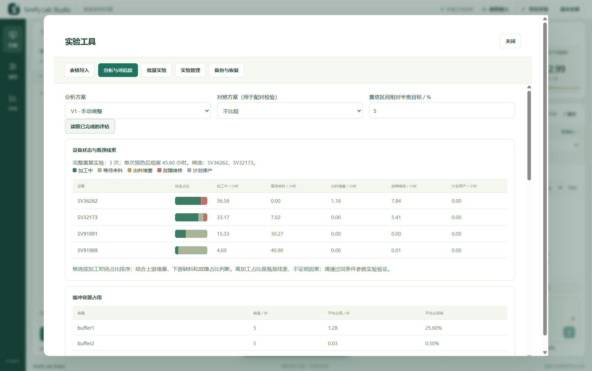

# v1.3.0 高优先级优化实施记录

范围以用户 2026-09-17 提供的截图为准：5、9、10、13、15、17、21、24、25，共 9 项。`优化.md` 的论文路线是历史分析材料，不是本次功能清单。

原版分支：`archive/v1.2.0-before-priority-upgrades`，保留修改前 main 的提交 `12a6b32`；既有发行标签与下载资产保持不变。

实施与验收：

- [x] 5：草稿与最近实验保存在应用数据目录，跨端口/清缓存可恢复，包含未发送对话、表单与图形草稿；并发草稿冲突不静默覆盖。
- [x] 9：CSV/XLSX 读取、字段映射、行号错误、预览后应用；失败不修改模型。
- [x] 10：参数单位/范围说明、字段定位、关联约束和后端校验。
- [x] 13：重复实验设备状态分解、缓冲占用和采样热力图，说明瓶颈判断的适用范围。
- [x] 15：有上限的参数网格、顺序实验队列、取消待运行项、排名比较及方案选择。
- [x] 17：条件一致的配对统计检验、精度驱动的重复次数建议、实测参照与候选方案校准比较。
- [x] 21：主动连接测试，区分认证、地址、模型、超时等错误；测试不保存输入密钥或修改当前接入。
- [x] 24：搜索/重命名/标签/归档，完整实验包恢复，定期本地备份及保留数量。
- [x] 25：仓库、分支、产品名、版本号和操作文档统一；历史发布说明保留历史含义。

所有 AI 自动化测试使用注入响应或本地模拟服务，不调用用户的真实付费 API。发布前完成回归、桌面构建自检、安装/升级/卸载验证；最终在 main 发布 v1.3.0。

## 操作入口

仿真工具栏中的 **实验工具** 包含表格导入、分析与可信度、批量实验、实验管理、备份与恢复五个页面。原有模型、运行助手、历史详情、图形编辑与报告入口继续可用。

### 草稿与异常恢复（5）

表单输入、图形草稿、未发送提示词、最近实验和回放位置保存到 `%LOCALAPPDATA%\SimPy Lab Studio\experiments`。更换后台端口、清除浏览器缓存后，仍可从同一数据目录恢复。输入停止约 0.5 秒后保存，回放位置每 5 秒更新；异常退出可能丢失最后一次尚未落盘的短暂编辑。恢复回放后处于暂停状态。

草稿与创建时的方案关联，另一窗口修改会提示冲突，避免静默覆盖。此功能恢复已计算结果的回放位置；未完成的仿真进程仍须重跑，不等同于第 11 项运行检查点续算。草稿不包含模型接入表单或密钥。

### 表格导入与输入检查（9、10）

1. 在输入模型中点击 **导入表格**，选择加工设备或缓冲容器；可先下载当前模型的 CSV 模板。
2. 选择 CSV 或 `.xlsx`，Excel 支持选择工作表。CSV 支持 UTF-8 与 GB18030。单文件最多 1 MB、500 行、40 列；不执行公式。
3. 将名称列与各参数列映射，指定可用率是 0–1 还是百分比。名称须匹配已有对象；空单元格保持原值。
4. 点击 **检查并预览修改**，错误表显示原文件行号。全部校验通过后，点击 **应用到输入草稿**，再通过原来的 **应用修改并预览** 创建方案。

字段下方说明单位和硬性边界，错误时展开相应设备并定位字段。可用率与维修时间、预热与总时长等约束仍使用原模型校验。功率异常等合理性提醒不会擅自改变参数。论文模式仍保留原有设备顺序与容量约束。

### 瓶颈与可信度（13、17）

先完成目标方案的 **完整重复评估**。分析页面提供加工、堵塞、缺料、故障、非工作时间的平均占比与时长，以及缓冲区平均占用。每次独立重复的占用热力图来自完整实验；时间序列热力图来自同版本的预览采样，并明确标注短时、采样口径。

瓶颈候选依据加工占比与上下游状态提供排查线索，不是因果证明。与对照方案比较时，检查实验时长、预热、重复次数、随机种子、班次与随机流语义是否一致。使用 **双侧精确配对符号检验**，排除相同差值，并对三个指标作 Bonferroni 校正。该检验回答配对变化方向是否有证据，不是均值差异的 t 检验；显著性不等于工程收益或最优方案。实现依据 [NIST 符号检验说明](https://www.itl.nist.gov/div898/software/dataplot/refman1/auxillar/signtest.htm)。

重复次数建议以先导样本标准差、正态近似和目标相对半宽估算，超过现有单次 50 次上限会提示。样本很少时估计不稳定，零均值不能用相对精度，建议不是精度保证。

实测校准可手动填写产出率、平均在制品、单位能耗，也可导入两列表格 `metric,value`，其中 metric 使用 `throughput_per_hour`、`avg_wip`、`specific_energy_kwh_per_part`。记录实际班次等口径并确认一致后，显示相对偏差及归一化均方根相对误差。可进一步通过批量参数扫描寻找误差较小的候选；不会自动改动仿真引擎或证明模型已通过外部验证。

### 批量方案（15）

先保存模型草稿。在 **批量实验** 选择 1–3 个参数，每项输入 1–6 个不重复候选值，最多 20 个组合。实验时长、重复次数和种子固定，所有组合先统一校验后才加入队列；另有总预计事件量限制。

任务依次计算，支持取消尚未开始的项目；当前正在计算的项目会完成并保留结果。退出软件后未完成队列标记中断，不自动重启计算。可以按三个 KPI 或实测误差排序，查看方案完整详情或采用候选创建新方案。扫描结果是给定候选范围内的比较，未经独立确认的筛选胜出方案不代表统计意义上的最优。

### API 连接测试（21）

在 **模型接入** 填写地址、模型、接口格式和密钥，点击 **测试连接**。测试使用当前未保存的输入发送一条很短的请求，约 15 秒超时；可能产生少量 API 费用，不会保存配置、切换当前模型或开始调整生产线。

提示区分未填密钥、认证失败、模型不存在、服务限额、超时与协议问题。如果服务仅返回含糊的 404，则显示“地址或模型”而非作无法确认的判断。错误消息不回显服务端原始响应中的敏感内容。连接通过仅证明所选接口接受请求，不能保证后续模型总能返回合规调整。

### 实验管理和备份（24）

实验可按名称或标签搜索，支持重命名、标签、归档/取消归档、打开及完整导出。归档仅控制列表显示，不删除数据。

**备份与恢复** 默认在软件运行时每小时备份、保留最近 5 份；可关闭或设为 15 分钟 / 6 小时，保留 1–20 份。手动备份也使用该保留策略。备份包含实验版本、对话、已完成运行、草稿、批次和实测参照，不含 API 配置或密钥。备份位于实验数据目录的 `backups`，可下载副本到外部磁盘。

支持导入旧版完整实验 ZIP 和新备份 ZIP，最多 64 MB 压缩体积、256 MB 展开体积、100 个实验、3000 个成员文件。恢复先验证并暂存全部内容，再创建独立实验副本；已有实验不被覆盖。未完成运行需重新执行；解包过程不直接提取 ZIP 路径。仅保存在同一磁盘上的备份不能抵御该磁盘损坏。

## 开发验证

`tests/test_studio_tools.py` 覆盖草稿冲突、重启恢复、表格边界、统计公式、批次取消、备份无密钥、恢复失败原子性和连接错误分类。`tools/check_priority_browser.cjs` 使用隔离测试服务完成真实表单、文件导入、批量计算、统计、备份恢复及多尺寸界面验证。EXE 自检额外执行内置 XLSX 读取、草稿和备份，确保安装后不依赖开发环境。

本次实际验证记录见 [v1.3.0 发布验证](releases/v1.3.0-validation.md)。
