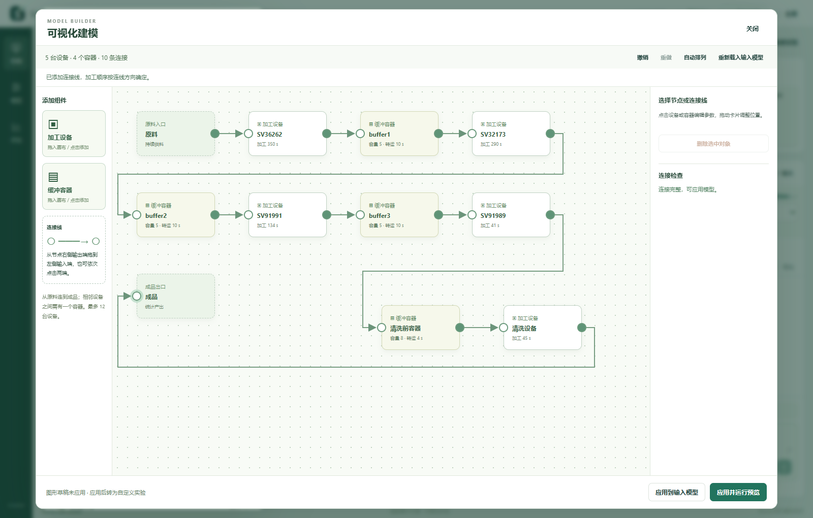

# 可视化建模（改进名单第 6 项）

本功能自 v1.2.0 正式版提供，对应改进名单第 6 项。点击主界面“图形建模”，或“编辑模型 → 拖拽编辑设备、容器与连接线”，即可打开图形编辑窗口。当前输入表中尚未保存的参数会一起带入。



## 操作步骤

1. 从左侧把“加工设备”或“缓冲容器”拖入画布。也可点击组件按钮添加，再拖动卡片调整位置。
2. 点击节点，在右侧填写名称、加工时间、可用率、维修时间、功率，或容器的容量、转运时间。
3. 从节点右侧的实心输出端拖到目标左侧的空心输入端，建立有向连接。也可依次点击两端；键盘 Tab 定位端口，Enter 激活。
4. 要替换连接，先选中原连接线，再点“删除选中对象”或按 Delete；随后重新连线。删除设备/容器也会删除相连的线，其余节点保留。
5. 右侧“连接检查”列出未接入的节点与参数错误，点击带下划线的问题可定位对象。连接完整且参数合规时才可应用。
6. “应用到输入模型”把图形转为参数表，便于检查；之后仍需保存并运行。“应用并运行预览”会沿用原有版本保存、后端校验和仿真流程。

例如在末尾增加一台清洗设备：拖入一个容器和一台设备，删除原末台设备通向成品的连接，再连接“原末台设备 → 新容器 → 清洗设备 → 成品”。新增对象默认有一组可编辑参数，运行前请按实际设备确认。

## 编辑行为

- 实际加工顺序由连接线决定。自由拖动卡片只调整画布位置；“自动排列”按连接顺序排布完整模型。
- 每个端口只能连接一条线。产线须从原料出发，经设备与容器交替连接，最终到达成品，所有节点都要在同一条线上。最多 12 台设备、11 个中间容器，也支持只有一台设备且没有中间容器的模型。
- 原料与成品端点可以移动，不能删除。自环、环路、重复线、分支和汇合连接会被拒绝。
- 保持案例一的设备/容器名称顺序和容器容量时，可继续用论文模式。改变结构、顺序、名称或固定容量后，应用时进入自定义实验，并提前在底部提示。
- 撤销/重做覆盖添加、删除、连线、参数与位置编辑，最多保留 80 步。画布上可用 Ctrl+Z / Ctrl+Shift+Z 或 Ctrl+Y；选中节点后可用方向键移动，Shift+方向键加大移动距离。输入框内保留原生文本编辑快捷键。
- 关闭、点击窗口外或按 Esc 返回时，本次图形草稿保留在当前窗口会话中。连线或拖动过程中按 Esc 先取消操作。图形未应用时，“图形建模”按钮会标记“草稿”。
- 已应用的画布位置保存在本机界面存储中，按实验与节点顺序区分，保留最近 20 组布局；位置不进入物理模型、不参与 KPI 计算。没有可用的布局记录时，自动按模型生成画布。
- 重新载入输入模型会替换当前图形草稿并清空撤销记录。如果输入模型或方案在图形编辑期间发生变化，旧图形不能覆盖新输入，应先重新载入。
- 打开或编辑图形不会暂停已播放的预览。只有明确运行新模型时，才走原有的暂停、校验、新版本和重新仿真流程。

此项为现有**串联模型的可视化编辑**。并行、分支、汇合、返工和多产品路线属于名单第 7 项；任意图结构没有被转换成未经实现的仿真模型。主仿真画面沿用已有的串联展示，顺序与图形中确认的连接一致。

图形草稿不会替代既有模型或运行结果；未应用的图形草稿只在当前软件窗口会话内保留。意外退出后的未保存草稿恢复属于名单第 5 项。已保存模型继续通过原有实验存储和导出功能管理。

## 实现与验证

`model-graph.js` 负责图形结构及转换，`visual-editor.js` / `visual-editor.css` 负责拖放、端口连接、参数面板和窗口交互。输出仍是原有 `ManufacturingConfig`，保留实验时长、预热、重复次数、随机种子、原料容量和班次。SimPy 引擎、统计口径和 API 结构不变；后端仍执行最终参数与计算规模校验。

```powershell
node --test tools/check_model_graph.cjs
# 启动 tests/studio_browser_fixture.py 并设置 STUDIO_TEST_URL 后：
node tools/check_visual_editor_browser.cjs
node tools/check_workspace_browser.cjs
node tools/check_topology_browser.cjs
node tools/check_conversation_browser.cjs
```

测试覆盖模型往返、连接重排、孤立节点/环路/分支拒绝、物理参数约束、真实鼠标拖放与连线、撤销/重做、参数表互通、实际五设备仿真、运行中查看、窗口布局、保存位置、输入冲突与后端错误展示。所有 AI 相关回归使用独立注入测试服务，不调用付费模型。
